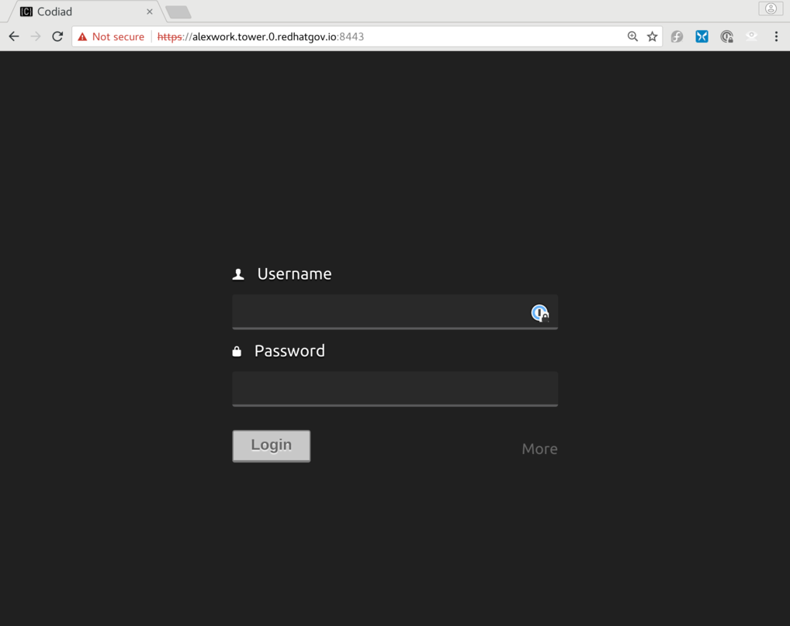

# Ansible Tower Workshop


`Ansible_Tower_Workshop` is a ansible playbook to provision Ansible Tower in Alibaba Cloud. This playbook uses Ansible to wrap Terraform, for provisioning Alibaba Cloud infrastructure and nodes. To find more info about Terraform [check here](https://www.terraform.io/docs/providers/alicloud/index.html)

These modules all require that you have Alibaba Cloud API keys available to use to provision Alibaba Cloud resources. You also need to have access key permissions set to allow you to create resources within Alibaba Cloud. There are several methods for setting up you Alibaba Cloud environment on you local machine.

Fill out `env.sh` & Export the Alibaba Cloud API Keys

First, copy env.sh_example to env.sh, and then fill in your API keys.  Once that is complete, source the script, to export your Alibaba Cloud environment variables.

```
source env.sh
```

This repo also requires that you have Ansible installed on your local machine. For the most upto date methods of installing Ansible for your operating system [check here](http://docs.ansible.com/ansible/intro_installation.html).

This repo also requires that Terraform be installed if you are using the alicloud.infra.terraform role. For the most upto data methods of installing Terraform for your operating system [check here](https://www.terraform.io/downloads.html).


## Alibaba Cloud Infrastructure Roles


### roles/alicloud.infra.terraform

To create infrastructure and a Ansible Tower instance via Terraform:

**** OS X
```
sudo easy_install pip
sudo pip install boto
sudo pip install ansible
sudo pip install passlib
/usr/bin/ruby -e "$(curl -fsSL https://raw.githubusercontent.com/Homebrew/install/master/install)"
brew install terraform
```

**** RHEL/CentOS
```
sudo yum install https://dl.fedoraproject.org/pub/epel/epel-release-latest-7.noarch.rpm
# server
subscription-manager repos --enable="rhel-7-server-rpms" --enable="rhel-7-server-extras-rpms" --enable="rhel-7-server-optional-rpms"
# workstation
subscription-manager repos --enable="rhel-7-workstation-rpms" --enable="rhel-7-workstation-extras-rpms" --enable="rhel-7-workstation-optional-rpms"
sudo yum -y install python2-boto ansible
wget https://releases.hashicorp.com/terraform/0.9.11/terraform_0.9.11_linux_amd64.zip # current release as of this date...check to see if a newer version is availabke
sudo unzip terraform_0.9.11_linux_amd64.zip -d /usr/local/bin terraform
```

**** Fedora 25/26
```
sudo dnf -y install python2-boto ansible
wget https://releases.hashicorp.com/terraform/0.9.11/terraform_0.9.11_linux_amd64.zip # current release as of this date...check to see if a newer version is availabke
sudo unzip terraform_0.9.11_linux_amd64.zip -d /usr/local/bin terraform
```

Then edit `group_vars/all` and fill in the vars with your Alibaba Cloud api info. This role can also provide easy domain name mapping to all the instances if you have a domain registered in Alibaba Cloud.

```
#####################################################
# Domain Name you own
#####################################################
domain_name: ""

#####################################################
# Alibaba Cloud API Keys for terraform.tfvars file
#####################################################
alicloud_access_key:                   ""
alicloud_secret_key:                   ""
```

```
ansible-playbook 1_provision.yml  
ansible-playbook 2_load.yml -K
```

To destroy

```
ansible-playbook 3_unregister.yml # only need to run this if you aren't using Cloud Access
ansible-playbook 4_destroy.yml
```

## Configure Workshop Nodes

To install and configure the necessary software, on the newly created nodes, run the second playbook.  It may be re-run as many times as necessary.

```
ansible-playbook 2_load.yml -K
```

## Login to Ansible Tower

Browse to the URL of the ECS instance and enter the `ecs-user`'s password (workshop_password:) located in `group_vars/all`.

```
https://{{ workshop_prefix }}.tower.0.{{ domain_name }}:8888/wetty/ssh/ecs-user
```


There is a web-based IDE running on port 8443 of each tower node.  That IDE can be used to edit Ansible playbooks, rather than using a command line editor, like `vim` or `nano`.



## Walkthrough for Scripts

A walkthrough for most of the typewritten steps has been added to the workshop, both to speed up workshops presented within a limited schedule, or to help a studenmt who has made a mistake, or who has fallen far behind.

The walkthrough is deployed on the tower nodes, in `~ecs-user/walkthrough`.
